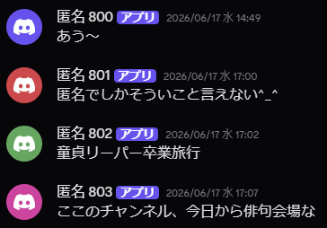

<h1>
  匿名チャットDiscordBot
  
  
  
  
  
</h1>
新規参入、活発化のために作られたDiscord上に完全匿名チャットを実装するBot!! 
 

 
匿名チャットの様子

 

## なんのためにつくった...?

サーバー新規参入者にとってみんな共通の顔見知りがあるなかで喋るのは難しい...  
匿名チャットはそんな過疎鯖を活性化するために作られました。  
大型鯖で導入する際は匿名の性質上荒れることも考え、匿名経由での処罰機能等も実装しております！！ 

現在、Beta版として7000人越の鯖に仮導入しております。もし導入したい方はご相談を...

## 軽い説明

このBotは、Discordサーバー内に匿名掲示板のような機能を追加するためのBotです。  
ユーザーは**完全匿名でメッセージを投稿**でき、投稿者は他のユーザーには分かりません。  
「匿名つぶやきモード」と「匿名要望モード」の2つの運用形態をサポートしています。  
処罰等をしたい場合なども、**Bot経由で処罰が実行されるため、サーバー運営者にも誰かわかることはありません!!**  

## 特徴など...

* **モード:**
  * **匿名チャットモード:** メッセージに「匿名 001」のようなIDが付与される標準的なモードです。
  * **匿名要望モード:** IDが表示されず「匿名」としてのみ表示される、要望や意見募集に適したモードです。
* **画像:** どちらのモードでも専用ボタンから安全に画像を投稿できます。
* **メッセージの編集・削除・返信:** 投稿者本人は投稿したメッセージを後から操作でき、他者の匿名投稿への返信も可能です。
* **通報システム:** ユーザーは不適切なメッセージを簡単に通報できます。一定数の通報が集まると、自動的に管理者に通知されます。

## コマンドリスト

### ユーザー向け (メッセージを右クリック or 長押し > アプリ)

* `メッセージに返信`: 指定した匿名メッセージに対して返信を行います。(>>[数字]の形式で)
* `メッセージを編集`: 自分が投稿した匿名メッセージの内容を編集します。
* `メッセージを削除`: 自分が投稿した匿名メッセージを削除します。
* `匿名つぶやき通報`: 不適切だと思われる匿名メッセージをサーバー管理者に通報します。

### 管理者向け

* `!set`: 実行したチャンネルを「匿名つぶやきモード」として設定します。
* `!setyoubou`: 実行したチャンネルを「匿名要望モード」として設定します。
* `/ban id: [メッセージID or URL]`: 匿名メッセージを指定して処罰メニューを表示します。
* `/border [人数]`: 通報が管理者に通知されるまでの閾値を設定します。
* `/word [add/remove] [単語]`: 禁止キーワードを管理します。
* `/domain [add/remove] [URL]`: 禁止ドメインを管理します。
* `/log switch [ON/OFF]`: ログ保存・通報機能の有効化を切り替えます。
* `/log channel [チャンネル]`: 通報（レポート）の送信先を設定します。
* `/log punish_channel [チャンネル]`: 処罰が実行された際のログ送信先を設定します。

## ライセンス

[AGPL-3.0](LICENSE)  
改変した後、ネットワーク経由でユーザーにサービスを提供する場合、ソースコードの公開義務が発生します。

---

© 2026 yexe
